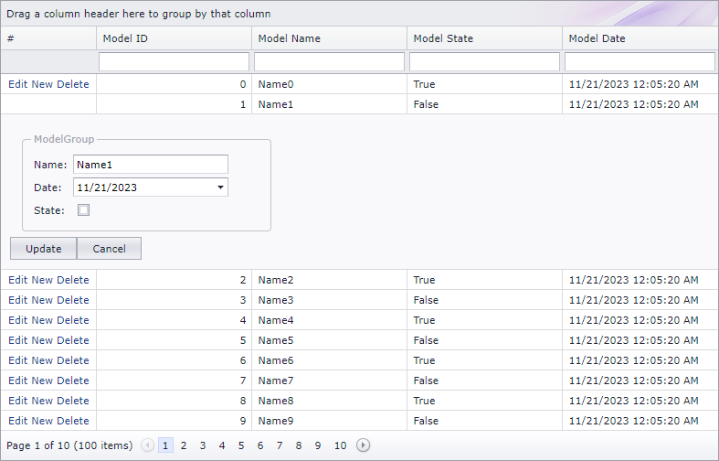

<!-- default badges list -->

[](https://supportcenter.devexpress.com/ticket/details/T102593)
[](https://docs.devexpress.com/GeneralInformation/403183)
<!-- default badges end -->

# Grid View for ASP.NET Web Forms - How to define FormLayout inside edit form template
<!-- run online -->
**[[Run Online]](https://codecentral.devexpress.com/t102593/)**
<!-- run online end -->

This example demonstrates how to use the [SetEditFormTemplateContent](https://docs.devexpress.com/AspNetMvc/DevExpress.Web.Mvc.GridViewSettings.SetEditFormTemplateContent(System.Action-DevExpress.Web.GridViewEditFormTemplateContainer-)) method to define the [FormLayout](https://docs.devexpress.com/AspNetMvc/16028/components/site-navigation-and-layout/formlayout) extension in edit form template.



```csharp
settings.SetEditFormTemplateContent(c => {
    var editItem = ViewData["Item"] != null ? ViewData["Item"] : c.DataItem;
    Html.DevExpress().FormLayout(set => {
        set.Name = "FormLayout";
        // ...               
    }).Render();
  // ...
});
```

## Files to Review

* [_GridViewPartial.cshtml](./CS/Q588216/Views/Home/_GridViewPartial.cshtml)
* [HomeController.cs](./CS/Q588216/Controllers/HomeController.cs) (VB: [HomeController.vb](./VB/Q588216/Controllers/HomeController.vb))
